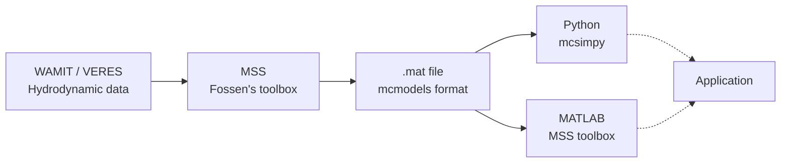

# Models and Analysis provided by Marine Cybernetics Laboratory

This repository is the inventory of hydrodynamic models for vessels used by
the Marine Cybernetics Laboratory (MCLab). Each vessel's raw analysis --
[WAMIT](https://www.wamit.com/) (3D panel method, used for station-keeping /
DP) and [VERES](https://www.sintef.no/en/software/shipx/) (2D strip theory
via ShipX, used for maneuvering) -- is converted with the
[MSS toolbox](https://github.com/cybergalactic/MSS) into a common `.mat`
vessel struct, which is then consumed either directly in MATLAB/Simulink or
via [`mcsimpy`](https://github.com/NTNU-MCS/mcsimpy) in Python.

## Documentation

- [`data/vessels/readme.md`](data/vessels/readme.md) -- per-vessel folder
  layout (`mesh/`, `hydro/wamit/`, `hydro/veres/`) and what each subfolder
  holds.
- [`scripts/readme.md`](scripts/readme.md) -- converting raw WAMIT runs into
  MSS vessel structs / state-space models (`wamit_v7_to_v6.py`,
  `vessel_station_keeping.m`, and related helper scripts).
- [ShipX / VERES guide](docs/ShipX%20guideline/ShipX_guide.md) -- full ShipX
  workflow from task creation to results, with a CS-Voyager worked example.
- [external/MSS/README.md](external/MSS/README.md) -- the vendored MSS
  toolbox (Fossen's Marine Systems Simulator), plus install guides for
  [MATLAB](external/MSS/How%20to%20install%20MSS%20for%20MATLAB.md) and
  [GNU Octave](external/MSS/How%20to%20install%20MSS%20for%20GNU%20Octave.md).

## Data pipeline

## Vessel inventory

| Vessel | WAMIT | VERES |
| --- | --- | --- |
| [drillship](data/vessels/drillship) | ✅ | ❌ |
| [enterprise](data/vessels/enterprise) | ✅ | ❌ |
| [gunnerus](data/vessels/gunnerus) | ❌ | ❌ |
| [ma1](data/vessels/ma1) | ✅ | ❌ |
| [voyager](data/vessels/voyager) | ✅ | ❌ |
